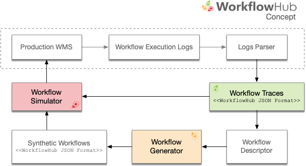

# The WorkflowHub Project

The **WorkflowHub project** is a community framework for enabling scientific 
workflow research and education by providing foundational tools for analyzing 
workflow execution traces, and generating synthetic, yet realistic, workflow 
traces that can be used to develop new techniques, algorithms and systems 
that can overcome the challenges of efficient and robust execution of ever 
larger workflows on increasingly complex distributed infrastructures. 
The figure below shows an overview of the workflow research life cycle process 
that integrates the three axis of the WorkflowHub project:

  

The _first axis_ (**[Workflow Traces](/traces)**) of the WorkflowHub project 
targets the collection and curation of open access production workflow executions 
from various scientific applications shared in a common trace format (i.e., 
The WorkflowHub JSON Format). 

The _second axis_ (**[Workflow Generator](/generator)**) of the WorkflowHub 
project targets the generation of realistic synthetic workflow traces based on 
workflow execution profiles extracted from execution traces.

The _third axis_ (**[Workflow Simulator](/simulator)**) of the WorkflowHub project 
fosters the use of simulation for the development, evaluation, and verification 
of scheduling and resource provisioning algorithms (e.g., multi-objective function 
optimization, etc.), evaluation of current and emerging computing platforms (e.g., 
clouds, IoT, extreme scale, etc.), among others.

## The WorkflowHub Python Package

[![PyPI version][pypi-badge]][pypi-link]
[![Travis][travis-badge]][travis-link]
[![License: LGPL v3][license-badge]][license-link]
[![Documentation Status][rtd-badge]][rtd-link]

In order to allow users to easily interact with workflow execution traces and 
synthetic workflows, the WorkflowHub project provides a collection of tools 
released as an open source Python package, in which enables:

- Analysis of traces of actual workflow executions;
- Production of recipes structures for creating workflow recipes for workflow generation; and
- Generation of synthetic realistic workflow traces.

The [Python package documentation](https://workflowhub.readthedocs.io) provides 
all necessary information on how to install and use the available tools.

[pypi-badge]:          https://badge.fury.io/py/workflowhub.svg
[pypi-link]:           https://badge.fury.io/py/workflowhub
[travis-badge]:   https://travis-ci.org/workflowhub/workflowhub.svg?branch=master
[travis-link]:    https://travis-ci.org/workflowhub/workflowhub
[license-badge]:  https://img.shields.io/badge/License-LGPL%20v3-blue.svg
[license-link]:   https://github.com/workflowhub/workflowhub/blob/master/LICENSE
[rtd-badge]:      https://readthedocs.org/projects/workflowhub/badge/?version=latest
[rtd-link]:       https://workflowhub.readthedocs.io/en/latest/?badge=latest
